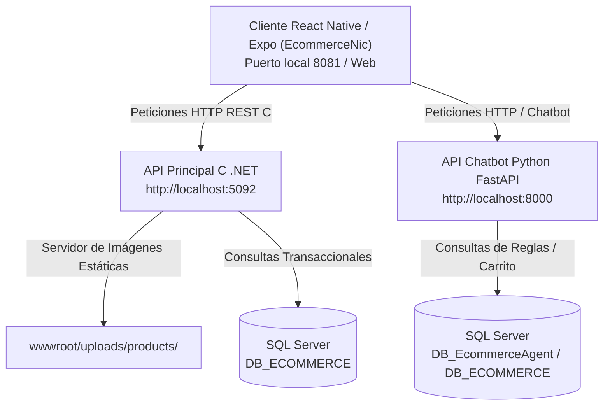

 Manual de Instalación, Configuración y Ejecución Completo

> Sistema E-Commerce Multiplataforma & Asistente IA (NicaBot)  
> Tecnologías: Base de Datos SQL Server + API Backend .NET (C) + API Chatbot FastAPI (Python)  Cliente Frontend Expo (React Native / TypeScript)  
> Ubicación del Documento: `E_COMMERCEDEV\REACT\analisis\manual_instalacion_y_ejecucion_completo.md`  
> Público Objetivo: Desarrolladores, Administradores de Sistemas y Evaluadores del Proyecto, jajaja para sonar formal saludos.

---

 Tabla de Contenidos
1. [1. Visión General de la Arquitectura del Sistema](1-visión-general-de-la-arquitectura-del-sistema)
2. [Fase I: Requisitos del Sistema y Base de Datos SQL Server](fase-i-requisitos-del-sistema-y-base-de-datos-sql-server)
3. [Fase II: Instalación, Configuración y Servidor de Imágenes de la API .NET (C)](fase-ii-instalación-configuración-y-servidor-de-imágenes-de-la-api-net-c)
4. [Fase III: Instalación, Configuración y Levantamiento de la API de Python (`chatbot_api`)](fase-iii-instalación-configuración-y-levantamiento-de-la-api-de-python-chatbot_api)
5. [Fase IV: Instalación, Configuración y Despliegue del Cliente Frontend (`EcommerceNic`)](fase-iv-instalación-configuración-y-despliegue-del-cliente-frontend-ecommercenic)
    [1. Prerrequisitos de Node.js y npm](1-prerrequisitos-de-nodejs-y-npm)
    [2. Instalación de Dependencias (Manejo de Errores con `--force`)](2-instalación-de-dependencias-manejo-de-errores-con---force)
    [3. Explicación Detallada del Archivo `.env` en React Native (Expo)](3-explicación-detallada-del-archivo-env-en-react-native-expo)
    [4. Verificación de Tipos TypeScript](4-verificación-de-tipos-typescript)
6. [Fase V: Opciones de Ejecución del Cliente Frontend](fase-v-opciones-de-ejecución-del-cliente-frontend)
7. [Atajos Teclado en Consola Expo](atajos-de-teclado-en-la-consola-de-expo)
8. [Resolución de Problemas Frecuentes (Troubleshooting)](resolución-de-problemas-frecuentes-troubleshooting)
9. [Resumen Secuencial de Comandos para el Día a Día](resumen-secuencial-de-comandos-para-el-día-a-día)
10. [Anexo: Nuevas Librerías e Instalaciones Adicionales (Expo SDK 54)](10-anexo-nuevas-librerías-e-instalaciones-adicionales-expo-sdk-54)

---

 1. Visión General de la Arquitectura del Sistema

El ecosistema e-commerce está diseñado bajo una arquitectura limpia y desacoplada multicapa compuesta por 4 módulos interconectados:



 Mapa de Puertos y Servicios Locales
| Servicio | Tecnología | Puerto Predeterminado | Dirección Base |
| :--- | :--- | :---: | :--- |
| API Principal (E-Commerce) | .NET / C | `5092` | `http://localhost:5092` |
| API Chatbot IA (NicaBot) | Python / FastAPI | `8000` | `http://localhost:8000` |
| Frontend Móvil & Web | React Native / Expo | `8081` / `19006` | `http://localhost:8081` |

---

 Fase I: Requisitos del Sistema y Base de Datos SQL Server

Antes de iniciar cualquier componente, asegúrate de contar con los componentes base de la plataforma:

1. Sistema Operativo: Windows 10 u 11 (64-bit).
2. Microsoft SQL Server (2019 o superior / Express / Developer):
   - Deben estar creadas las bases de datos transaccionales `DB_ECOMMERCE` y `DB_EcommerceAgent`.
   - Ejecutar los scripts de stored procedures en `Database/E-commerce/SP/` e inserción de imágenes semilla en `Database/E-commerce/seeders/01_Insert_Product_Images_Seed.sql`.
3. Microsoft ODBC Driver for SQL Server (Crítico):
   - Tanto la API de .NET como el driver `pyodbc` de Python requieren el driver nativo de Microsoft instalado en Windows.
   - Driver Requerido: `ODBC Driver 17 for SQL Server` (o `ODBC Driver 18 for SQL Server`).
   - Descargar: [Microsoft ODBC Driver for SQL Server (x64)](https://learn.microsoft.com/es-es/sql/connect/odbc/download-odbc-driver-for-sql-server)

---

 Fase II: Instalación, Configuración y Servidor de Imágenes de la API .NET (C)

La API principal en C administra los catálogos, autenticación, carrito de compras y la entrega de recursos multimedia (imágenes de productos).

 1. Servidor de Archivos Estáticos en `Program.cs`
Asegúrate de que en `API/API_ECCOMERCEDEV/PRESENTACION/Program.cs` se encuentre configurada la línea de archivos estáticos:

```csharp
app.UseCors("AllowAll");
app.UseStaticFiles(); // Habilita el servidor HTTP de imágenes desde wwwroot
```

 2. Configuración de Escucha en Red Wi-Fi (`launchSettings.json`)
Asegúrate de que en `API/API_ECCOMERCEDEV/PRESENTACION/Properties/launchSettings.json` la propiedad `applicationUrl` escuche en todas las interfaces para permitir peticiones desde celulares físicos:

```json
"applicationUrl": "http://0.0.0.0:5092;http://localhost:5092"
```

 3. Estructura de Carpetas de Imágenes en la API
Las imágenes físicas leídas por el cliente React residen en:
- `API/API_ECCOMERCEDEV/PRESENTACION/wwwroot/uploads/products/`
- `API/API_ECCOMERCEDEV/PRESENTACION/wwwroot/assets/img/products/`

 4. Sincronización Automática de Imágenes de Desarrollo
Para sincronizar las imágenes semilla de desarrollo hacia la carpeta de la API, ejecuta:

```cmd
node Database\E-commerce\seeders\process_images.js
```

 5. Compilación y Levantamiento de la API .NET
Navega al proyecto de presentación y ejecuta:

```cmd
cd E_COMMERCEDEV\API\API_ECCOMERCEDEV\PRESENTACION
dotnet build
dotnet run
```
La API escuchará en: `http://localhost:5092` y en tu IP local Wi-Fi.

---

 Fase III: Instalación, Configuración y Levantamiento de la API de Python (`chatbot_api`)

La API del Chatbot procesa el motor de reglas de inteligencia de negocios, la búsqueda semántica de productos y la persistencia de mensajes.

 1. Creación del Entorno Virtual de Python
Abre la consola de comandos (CMD) de Windows y ejecuta:

```cmd
cd E_COMMERCEDEV\chatbot_api
python -m venv venv
```

Activa el entorno virtual:
```cmd
venv\Scripts\activate
```
(Sabrás que está activo porque aparecerá el prefijo `(venv)` al inicio de la línea de comandos).

 2. Instalación de Dependencias
Actualiza el instalador de paquetes `pip`:
```cmd
python -m pip install --upgrade pip
```

Instala las librerías necesarias del proyecto:
```cmd
pip install fastapi "uvicorn[standard]" pyodbc python-dotenv pydantic
```

---

 3. Explicación Detallada del Archivo `.env` en Python

Crea el archivo `.env` en la ruta `E_COMMERCEDEV\chatbot_api\.env` con el siguiente contenido:

```ini
 Driver de conexión a SQL Server instalado en Windows
DB_DRIVER=ODBC Driver 17 for SQL Server

 Dirección del servidor de SQL Server (localhost o IP del servidor)
DB_SERVER=localhost

 Nombre de la Base de Datos del agente
DB_NAME=DB_EcommerceAgent

 Autenticación de Windows (yes = Windows Auth / no = Usuario y Contraseña)
DB_TRUSTED_CONNECTION=yes

 Campos obligatorios solo si DB_TRUSTED_CONNECTION=no:
DB_USER=sa
DB_PASSWORD=TuPassword123

 Tiempo límite de espera de respuesta (en segundos)
DB_TIMEOUT=30
```

---

 4. Prueba de Conexión a la Base de Datos
Verifica la conexión a SQL Server ejecutando:

```cmd
python -m tests.test_connection
```

 Resultado esperado: `Conexión exitosa`

---

 5. Comando para Levantar el Servidor Uvicorn
Para permitir conexiones de celulares en la red Wi-Fi local, debes incluir `--host 0.0.0.0`:

```cmd
uvicorn app.main:app --reload --host 0.0.0.0 --port 8000
```

 Verificación e Inspección Interactiva:
- Documentación Swagger UI: Abre [http://127.0.0.1:8000/docs](http://127.0.0.1:8000/docs) en tu navegador.

---

 Fase IV: Instalación, Configuración y Despliegue del Cliente Frontend (`EcommerceNic`)

El cliente Frontend está desarrollado en React Native / Expo con TypeScript, implementando arquitectura limpia (Clean Architecture), paginación remota, scroll infinito y optimización de renderizado de imágenes.

 1. Prerrequisitos de Node.js y npm
Verifica las versiones instaladas:
```cmd
node -v
npm -v
```

---

 2. Instalación de Dependencias (Manejo de Errores con `--force`)

Navega a la carpeta del cliente e instala las dependencias:

```cmd
cd E_COMMERCEDEV\REACT\EcommerceNic
npm install --force
```

> ¿Qué hacer si la instalación lanza errores de conflictos de peer dependencies?  
> Si `npm install` arroja un error de árbol de dependencias (`ERESOLVE unable to resolve dependency tree`), ejecuta la instalación forzada mediante el indicador `--force` o `--legacy-peer-deps`:
> 
> ```cmd
> npm install --force
> ```
> o también:
> ```cmd
> npm install --legacy-peer-deps
> ```

> Nota para desarrolladores que están actualizando la versión previa:  
> Si tenías la versión anterior instalada y estás migrando a los paquetes actualizados de Expo SDK 54, limpia la carpeta `node_modules` y vuelve a instalar:
> ```cmd
> rmdir /s /q node_modules
> npm install --force
> ```

---

 3. Explicación Detallada del Archivo `.env` en React Native (Expo)

Crea o verifica el archivo `.env` en la raíz del proyecto (`E_COMMERCEDEV\REACT\EcommerceNic\.env`):

```ini
 API Principal backend C (.NET)
EXPO_PUBLIC_API_URL=http://localhost:5092

 API Asistente IA backend Python (FastAPI)
EXPO_PUBLIC_CHATBOT_URL=http://localhost:8000
```

 Prefijo `EXPO_PUBLIC_`:
Expo exige el prefijo `EXPO_PUBLIC_` para autorizar explícitamente que una variable sea embebida en el bundle compilado cliente.

---

 4. Verificación de Tipos TypeScript
Para validar que no existan errores de tipado antes de levantar la app:

```cmd
npx tsc --noEmit
```

---

 Fase V: Opciones de Ejecución del Cliente Frontend

Desde la carpeta `E_COMMERCEDEV\REACT\EcommerceNic`:

 Opción 1: Modo Interactivo Completo (Recomendado)
```cmd
npx expo start
```

 Opción 2: Modo Navegador Web Directo
```cmd
npx expo start --web
```
o también:
```cmd
npm run web
```
Abre la aplicación directamente en Google Chrome (`http://localhost:8081`).

 Opción 3: Modo Emulador Android
```cmd
npx expo start --android
```

---

 Atajos de Teclado en la Consola de Expo

| Tecla | Acción |
| :---: | :--- |
| w | Abre la aplicación en el navegador Web. |
| a | Abre la aplicación en el Emulador Android. |
| r | Recarga la interfaz y vuelve a compilar el bundle (Reload). |
| c | Limpia la memoria caché de Metro Bundler (`clear cache`). |
| CTRL + C | Detiene el servidor de desarrollo. |

---

 Resolución de Problemas Frecuentes (Troubleshooting)

 1. Error de Instalación en React (`ERESOLVE unable to resolve dependency tree`)
- Solución: Ejecutar `npm install --force` o `npm install --legacy-peer-deps`.

 2. Error `No results. Previous SQL was not a query` en Chatbot Python
- Causa: Conteo de filas de SQL Server sin `SET NOCOUNT ON;`.
- Solución: Ya corregido en `actions_service.py`. En caso de persistir, reiniciar el servidor uvicorn.

 3. Imágenes no se muestran en React (Cuadro vacío / Error 404)
- Causa: La API de C no tiene corriendo `app.UseStaticFiles()` o faltan los archivos en `wwwroot/uploads/products/`.
- Solución: Ejecutar `node Database/E-commerce/seeders/process_images.js` y reiniciar la API de C.

 4. Error `Project is incompatible with this version of Expo Go`
- Causa: La aplicación cliente Expo Go instalada en el celular físico o emulador tiene una versión anterior al SDK del proyecto.
- Solución A (Modo Web sin Expo Go): Iniciar en modo web omitiendo Expo Go con `npx expo start --web`.
- Solución B (Celular Físico): Actualizar la aplicación Expo Go desde Google Play Store / App Store.
- Solución C (Sincronización de Paquetes): Ajustar paquetes en el proyecto ejecutando `npx expo install --fix`.

 5. Limpieza de Caché de Metro Bundler
Si realizaste cambios en `.env` o en dependencias y la app no responde:
```cmd
npx expo start -c
```


---

 10. Anexo: Nuevas Librerías e Instalaciones Adicionales (Expo SDK 54)

Durante la implementación del plan de imágenes, estado global, paginación, sincronización de carrito y compatibilidad móvil, se instalaron y configuraron las siguientes librerías:

 A. TanStack React Query (Paginación, Caché Global y Scroll Infinito)
Gestiona el estado remoto, paginación infinita en el catálogo (`useInfiniteQuery`), re-intentos automáticos y el caché global.
 Versión instalada: `^5.101.4`
 Comando de instalación:
  ```cmd
  npm install @tanstack/react-query
  ```

 B. Expo Image Picker (Selección y Previsualización de Imágenes)
Permite seleccionar imágenes desde la galería del celular o la cámara para los formularios de productos.
 Versión instalada: `~17.0.11` (Compatible con Expo SDK 54)
 Comando de instalación:
  ```cmd
  npx expo install expo-image-picker
  ```

 C. Componentes de UI y Selección Nativas (`Picker` & `Icons`)
 React Native Picker: `^2.11.1` (`npm install @react-native-picker/picker`)
 Vector Icons: `^10.3.0` (`npm install react-native-vector-icons @react-native-vector-icons/ionicons`)

 D. Verificación de Tipos TypeScript
Comprobación de tipos en arquitectura limpia sin errores de compilación:
 Comando de ejecución:
  ```cmd
  npx tsc --noEmit
  ```

---

 Resumen Secuencial de Comandos para el Día a Día

Para iniciar todo el sistema diariamente, abre 3 ventanas de terminal CMD y ejecuta los comandos en este orden:

 Consola 1: API Chatbot (Python)
```cmd
cd E_COMMERCEDEV\chatbot_api
venv\Scripts\activate
uvicorn app.main:app --reload --host 0.0.0.0 --port 8000
```

 Consola 2: API Principal (.NET C)
```cmd
cd E_COMMERCEDEV\API\API_ECCOMERCEDEV\PRESENTACION
dotnet run
```

 Consola 3: Frontend React Native (Expo)
```cmd
cd E_COMMERCEDEV\REACT\EcommerceNic
npx expo start --web
```
